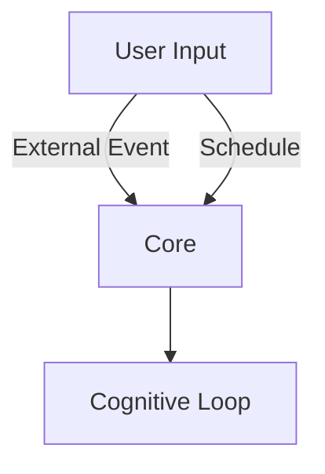
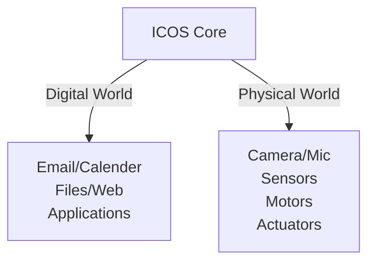

# ICOS v3 Core

## Description

The ICOS Core is the primary runtime of the ICOS cognitive architecture.

It is responsible for maintaining the active agent state and executing the continuous cognitive loop through which ICOS perceives input, retrieves relevant knowledge, constructs context, invokes models, evaluates results, performs actions, and consolidates experience into memory.

Core is intentionally opinionated. It is not intended to be a general-purpose agent framework or a compatibility layer for external agent runtimes. The runtime exists to implement the cognitive architecture required by ICOS.

External interfaces, model providers, tools, integrations, and embodied systems connect to Core through defined interfaces, while the cognitive loop and memory lifecycle remain under the control of ICOS.

### Responsibilities

Core is responsible for:

* Maintaining agent and session state
* Receiving and normalizing input from external interfaces
* Coordinating the cognitive loop
* Requesting relevant memory from the memory subsystem
* Constructing model context
* Invoking configured model providers
* Evaluating model output through Model Sentinel
* Determining whether additional reasoning, revision, or action is required
* Dispatching tools and external actions
* Recording observations and action outcomes
* Consolidating experiences into memory
* Managing interruptions and cancellation
* Coordinating subagents
* Managing active tasks and execution state
* Exposing the runtime to TUI, web, desktop, and embodied interfaces

Core does **not** own the implementation of individual model providers, tools, integrations, or user interfaces. It coordinates them as capabilities available to the cognitive runtime.

---

## Architectural Position

```text
                         ICOS CORE
┌──────────────────────────────────────────────────────────┐
│                                                          │
│                 Cognitive Runtime                       │
│                                                          │
│   Input → Recall → Context → Inference → Evaluation     │
│                              ↓                           │
│                       Action / Response                 │
│                              ↓                           │
│                       Consolidation                     │
│                              ↓                           │
│                           Memory                        │
│                              ↺                           │
│                                                          │
└───────────────┬───────────────┬──────────────────────────┘
                │               │
                ▼               ▼
           Model Providers    Capabilities
                │               │
          ┌─────┴─────┐     ┌───┴─────────────┐
          │           │     │                 │
       Provider A  Provider B Tools       Integrations
                              │                 │
                              ├─ Calendar       │
                              ├─ Email          │
                              ├─ Files          │
                              ├─ Camera         │
                              ├─ Audio          │
                              └─ Robot I/O      │
```

Core is the system that gives these capabilities cognitive context.

A calendar integration, for example, does not independently determine what is important. It provides observations and actions to Core. Core combines those observations with memory, current context, goals, and other available information to determine their significance.

---

# Core Cognitive Loop

The fundamental ICOS runtime is a continuous perception–cognition–action cycle.

```text
 INPUT / OBSERVATION
          │
          ▼
       CORE
          │
          ▼
    MEMORY RECALL
          │
          ▼
   CONTEXT CONSTRUCTION
          │
          ▼
        MODEL
          │
          ▼
   MODEL SENTINEL
          │
      ┌───┴────────┐
      │            │
    VALID         INVALID /
      │           UNCERTAIN
      │            │
      │            ▼
      │       REVISE / RETRY
      │            │
      │            └───────┐
      ▼                    │
   DECISION ◄──────────────┘
      │
 ┌────┴─────────────┐
 │                  │
 ▼                  ▼
RESPOND           ACT
 │                  │
 │             TOOL / SYSTEM
 │                ACTION
 │                  │
 │                  ▼
 │              OBSERVATION
 │                  │
 └──────────┬───────┘
            ▼
       CONSOLIDATION
            │
            ▼
          MEMORY
            │
            └──────────↺
```

The loop is not necessarily synchronous or limited to a single model invocation. A single user request may result in multiple cycles of inference, tool execution, observation, evaluation, and revision.

Core therefore maintains execution state rather than treating a model call as the complete unit of agency.

---

# Runtime Interface

Core exposes a runtime interface representing the fundamental operations of an ICOS agent.

```typescript
interface AgentRuntime {

    conversation(input: Input): Promise<Result>;

    generate(request: GenerationRequest): Promise<ModelResponse>;

    observe(observation: Observation): Promise<void>;

    tool_call(request: ToolRequest): Promise<ToolResult>;

    execute(action: Action): Promise<ActionResult>;

    interrupt(request: InterruptRequest): Promise<void>;

    result(execution: ExecutionResult): Promise<void>;
}
```

These operations represent runtime semantics rather than a required external API shape.

The implementation may expose these capabilities through internal TypeScript APIs, HTTP endpoints, WebSockets, IPC, or other mechanisms as appropriate.

The runtime interface exists to provide a stable boundary between ICOS Core and its external interfaces and capabilities.

---

# Conversation Processing

A conversation is treated as an instance of the general cognitive loop rather than as a special subsystem.

```typescript
async function processInput(input: Input): Promise<Result> {

    const session = await sessions.resolve(input);

    const memories = await memory.recall({
        input,
        session,
        profile
    });

    const context = cognition.buildContext({
        input,
        memories,
        session,
        profile
    });

    return await cognition.process({
        input,
        context,
        session
    });
}
```

Conversation interfaces are therefore clients of Core.

Possible interfaces include:

```text
TUI
Web
Desktop
Mobile
Voice
Robot
API
```

None of these interfaces should contain cognitive logic that belongs to Core.

---

# Memory Integration

Memory is a first-class component of the Core runtime.

Core does not treat memory as a generic RAG endpoint. Memory participates directly in the cognitive lifecycle.

At minimum, Core interacts with memory during:

1. **Recall** — retrieve information relevant to the current situation
2. **Association** — identify related knowledge, experiences, entities, and patterns
3. **Context formation** — incorporate recalled information into the current cognitive state
4. **Observation recording** — preserve significant inputs and external observations
5. **Action recording** — preserve actions taken by the agent
6. **Outcome recording** — associate actions with their results
7. **Consolidation** — transform significant experiences into durable memories
8. **Retrieval feedback** — record whether recalled information was useful
9. **Temporal updates** — update knowledge as facts become obsolete or change

```text
                 CORE
                  │
        ┌─────────┴─────────┐
        ▼                   ▼
      RECALL            CONSOLIDATE
        │                   │
        ▼                   ▼
   Context State        Experience
        │                   │
        └─────────┬─────────┘
                  ▼
             EPISODIC /
          SEMANTIC / PROCEDURAL
                  │
                  ▼
              RuVector
```

The cognitive semantics of memory belong to ICOS. RuVector provides the underlying storage, indexing, graph, vector, and retrieval capabilities.

---

# Context Construction

Context is constructed dynamically for each cognitive cycle.

Context may include:

* Current user input
* Recent conversation
* Active tasks
* Relevant memories
* Semantic knowledge
* Procedural knowledge
* Previous observations
* Previous actions and outcomes
* Current goals
* Active tool state
* External observations
* Subagent results
* Model-specific instructions
* Temporal context
* Confidence and provenance information

Core should avoid blindly injecting all available information into the model.

Context construction is a cognitive operation whose purpose is to produce the smallest useful representation of the current situation.

---

# Model Providers

ICOS Core may use one or more model providers.

A provider is responsible for translating a generation request into a model-specific invocation.

```typescript
interface ModelProvider {

    generate(
        request: GenerationRequest
    ): Promise<ModelResponse>;

}
```

Providers may expose:

* Local models
* OpenAI-compatible APIs
* Cloud models
* llama.cpp
* Ollama
* Other compatible inference systems

Core should not depend on the internal implementation of a specific provider.

Model selection may occur at runtime based on:

* Agent profile
* Task
* Subagent
* Capability requirements
* Context requirements
* Model availability
* Resource constraints

---

# Agent Profiles and Subagents

ICOS maintains a primary agent profile defining the default identity, configuration, capabilities, and model behavior of the agent.

Subagents are specialized execution contexts that may use different models or configuration.

```text
ICOS
 │
 ├── Isabel
 │     │
 │     ├── Primary Model
 │     ├── Research Subagent
 │     ├── Vision Subagent
 │     ├── Planning Subagent
 │     └── Other Specialized Agents
 │
 └── Shared Memory / Context
```

Subagents are not independent persistent agents unless explicitly required.

They are execution contexts operating within the larger ICOS cognitive system and may share memory, tools, observations, and execution state according to policy.

---

# Model Sentinel

Model Sentinel evaluates model outputs before they become trusted cognitive state or external actions.

It may evaluate:

* Unsupported claims
* Contradictions
* Hallucinations
* Incorrect tool interpretation
* Tool/result mismatch
* Invalid actions
* Missing information
* Confidence
* Internal consistency
* Evidence support

```typescript
const assessment = await sentinel.evaluate({
    input,
    context,
    response,
    toolResults
});
```

Possible outcomes include:

```text
VALID
REVISE
RETRY
REQUEST_INFORMATION
REQUIRE_CONFIRMATION
REJECT
```

Sentinel is therefore a control mechanism around inference rather than a replacement for inference.

---

# Tools and Capabilities

Tools provide Core with the ability to interact with external systems.

Examples include:

```text
Calendar
Email
Filesystem
Web
Databases
Smart Home
Camera
Microphone
Notifications
Computer Control
Robot Sensors
Robot Actuators
```

Tools should expose typed capabilities to Core.

```typescript
interface Tool {

    name: string;

    description: string;

    schema: ToolSchema;

    execute(
        request: ToolRequest
    ): Promise<ToolResult>;

}
```

Core determines **when and why** a capability is used.

The tool determines **how** the capability is executed.

---

# Observations

ICOS treats external information as observations rather than exclusively as user messages.

An observation may originate from:

* A person
* A conversation
* Calendar
* Email
* Files
* Camera
* Microphone
* Sensors
* Applications
* APIs
* Robot hardware
* Scheduled events

```typescript
interface Observation {

    source: string;

    timestamp: Date;

    type: string;

    data: unknown;

    confidence?: number;

    provenance?: Provenance;
}
```

This allows the same cognitive architecture to process both digital and physical environments.

---

# Actions and Outcomes

An action represents an intentional change initiated by ICOS.

```text
Intent
  ↓
Decision
  ↓
Action
  ↓
External System
  ↓
Observation
  ↓
Outcome
  ↓
Memory
```

Actions may include:

* Sending a message
* Creating or modifying a calendar event
* Updating a task
* Retrieving information
* Executing software
* Controlling hardware
* Moving a robot
* Producing a notification

Actions should produce observable results whenever possible.

This allows ICOS to associate decisions with their consequences and incorporate those consequences into future reasoning.

---

# Interruptions

The cognitive loop must support interruption.

An active execution may be interrupted by:

* User input
* Higher-priority task
* Safety condition
* External event
* Tool failure
* Resource constraint
* New observation
* System shutdown

```typescript
await runtime.interrupt({
    executionId,
    reason
});
```

Interruptions should preserve sufficient state for the runtime to determine whether execution should resume, restart, abandon the task, or escalate.

---

# Execution State

Core maintains the active state of cognitive execution.

Conceptually:

```typescript
interface ExecutionState {

    session: Session;

    profile: AgentProfile;

    input: Input;

    context: Context;

    memories: Memory[];

    actions: Action[];

    observations: Observation[];

    toolResults: ToolResult[];

    assessment?: SentinelAssessment;

    status: ExecutionStatus;
}
```

Execution state should be observable and recoverable where practical.

This becomes particularly important for long-running tasks and embodied systems.

---

# Scheduling and Autonomous Activity

Core may initiate cognitive cycles without direct user input.

Sources include:

* Scheduled tasks
* Calendar events
* Incoming messages
* System events
* Sensor observations
* Tool callbacks
* Robot events
* Internal timers

Therefore:



The distinction between "chat" and "autonomous operation" is therefore primarily the source of the initial observation.

---

# Interfaces

Interfaces provide human or machine access to Core.

Initial interfaces may include:

```text
TUI
Web
Desktop
```

Future interfaces may include:

```text
Mobile
Voice
Wearable
Robot
API
```

Interfaces should remain thin.

Their responsibilities are limited to:

* Presenting information
* Collecting input
* Displaying execution state
* Sending commands
* Receiving events
* Handling interface-specific interaction

Cognitive decisions remain inside Core.

---

# Embodiment

ICOS Core is designed to operate independently of a physical body.

Embodiment is provided through additional perception and action capabilities.



The same cognitive loop should therefore be capable of operating as:

* A conversational agent
* A desktop assistant
* A personal cognitive assistant
* An autonomous software agent
* An embodied robotic agent

The difference is primarily the available observation and action channels.

---

# Design Principles

### 1. Core owns the cognitive loop

The agent runtime is an ICOS subsystem, not an external dependency.

### 2. Memory is part of cognition

Memory is integrated into the runtime rather than treated as an optional RAG service.

### 3. External capabilities are replaceable

Model providers, tools, interfaces, and integrations may be replaced without changing the cognitive architecture.

### 4. Interfaces remain thin

TUI, web, desktop, voice, and robotic interfaces are clients of Core.

### 5. Actions produce observations

The system should learn from the outcomes of its own actions.

### 6. Context is constructed, not accumulated

The model receives the information required for the current cognitive task rather than an indiscriminate dump of available state.

### 7. ICOS is opinionated

The architecture is optimized for the ICOS research platform and its intended embodied applications rather than for generic agent-framework compatibility.

### 8. Minimize unnecessary abstraction

Abstractions should exist where they isolate genuinely replaceable components or represent meaningful cognitive concepts.

The architecture should not introduce abstraction layers solely for theoretical portability.

---

# Minimal Runtime

The initial implementation should remain small.

At minimum:

```text
ICOS Core
├── Session Management
├── Cognitive Loop
├── Memory Integration
├── Context Construction
├── Model Provider
├── Model Sentinel
├── Tool Execution
├── Execution State
└── Runtime API
```

Everything else should be added when an actual requirement emerges.

The objective is not to reproduce the feature set of an existing agent framework.

The objective is to build the smallest runtime capable of expressing the ICOS cognitive architecture.
