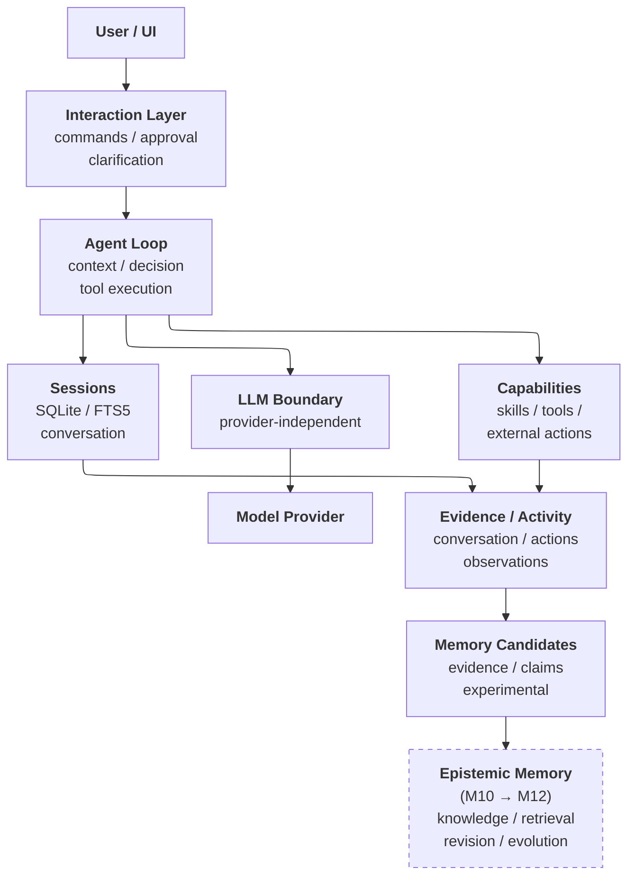

# ICOS v3

<center>


</center>

---

## What is ICOS?

**ICOS** (**I**SABEL **C**ognitive **O**perating **S**ystem) v3 is a from-scratch cognitive agent runtime built to investigate a simple question:

> **What is the minimum architecture required to give an agent persistent memory, useful knowledge, and meaningful agency?**

ICOS v3 is not a wrapper around an existing agent framework.

**The runtime is the harness.**

The agent loop, interaction layer, model boundary, session persistence, memory systems, skills, and future autonomous capabilities are being developed as parts of one deliberately small system.

The goal is not to reproduce a biological model of cognition. Instead, ICOS v3 is an experimental platform for identifying which architectural mechanisms actually produce useful changes in agent behaviour.

---

## Why v3?

ISABEL v2 explored a much more elaborate approach to cognitive architecture, incorporating biologically inspired mechanisms including persistent identity, multiple memory systems, state modulation, autonomous action selection, knowledge structures, and more.

That work was valuable, but it also exposed a problem:

**As the architecture became more complex, the architecture itself became a confounding variable.**

When an agent changed its behaviour, it became increasingly difficult to determine whether the change came from a particular mechanism or from its interaction with everything surrounding it.

ICOS v3 takes the opposite approach.

Start small.

Add capabilities deliberately.

Measure what changes.

Keep the system understandable.

> **If a capability cannot justify its complexity, it doesn't belong in the architecture yet.**

---

## Design Goals

ICOS v3 is being built around a few principles:

### Small enough to understand

The core should remain small enough that the entire agent loop can be understood without reconstructing a distributed system.

### Provider independent

The agent should not be coupled to a particular model provider.

ICOS communicates through an OpenAI-compatible interface, allowing the underlying model to be changed without rebuilding the runtime around it.

Current and planned providers include local and external model backends such as Ollama, llama.cpp, OpenCode, and OpenRouter.

### Evidence-driven

Capabilities are introduced incrementally.

Each milestone has a specific question, implementation target, and verification evidence.

The intention is to understand not only **whether something works**, but **what changed when it was introduced**.

### Experimental rather than general-purpose

ICOS is not intended to compete with general-purpose agent frameworks.

It exists primarily as a controlled environment for experimenting with agent architecture.

---

## Current Status

**M1–M7 are complete.**

The current system provides:

- A working conversation loop
- REST API
- Token streaming via SSE
- Persistent SQLite sessions
- FTS5 session recall
- Memory-candidate extraction
- An evidence ledger for extracted candidates
- Provider-independent LLM integration
- Slash commands
- Structured human approvals
- Structured clarification requests
- Standard-format skills support

The next milestone is **M8: Tools**.

Development is active and the architecture is expected to change substantially as new capabilities are introduced.

---

## Milestones

ICOS v3 is being developed as a sequence of increasingly capable experiments.

| Milestone | Question |
|:---:|---|
| **M1** | *Can it talk?* |
| **M2** | *Can it stream?* |
| **M3** | *Can it remember what happened?* |
| **M4** | *Can it notice potentially meaningful things?* |
| **M5** | *Can I change its brain without changing its body?* |
| **M6** | *Can a human interact with it properly?* |
| **M7** | *Can it acquire capabilities?* |
| **M8** | *Can it actually use those capabilities?* |
| **M9** | *Can it autonomously complete a task?* |
| **M10** | *Can it form knowledge?* |
| **M11** | *Can it retrieve and use that knowledge?* |
| **M12** | *Can that knowledge evolve?* |
| **M13** | *Can it expose its capabilities to other systems?* |
| **M14** | *Can it maintain a persistent persona?* |
| **M15** | *Can it detect and correct its own drift?* |
| **M16** | *Can it communicate through external channels?* |
| **M17** | *Can it autonomously select and execute actions?* |
| **M18** | *Can it perceive the world beyond conversation?* |
| **M19** | *Can it delegate work to other agents?* |
| **M20** | *Can it react to external events without requiring a conversational turn?* |
| **M21** | *Can it steward its own knowledge base?* |
| **Deferred** | ***Episodic consolidation:*** *Can experiences be abstracted into knowledge?* |
| **Deferred** | ***Source synchronization:*** *Can knowledge stay aligned with the world?* |

Each milestone is tracked in:

```text
.reference/plans/
```

Verification evidence is maintained in:

```text
.reference/plans/evidence/
```

The intent is for the repository to document the development process rather than simply present the final architecture.

---

# Getting Started

## Deployment target

The supported deployment target is a **Docker container**, defined by
`docker-compose.yml` and `core/Dockerfile`.

Run it wherever suits you: your local machine, or any host on your local
network (publish port `3000` accordingly). Bare-metal `npm run start` remains
available for local development, but Docker is the expected way to launch and
play with the stack.

## Requirements

- **Docker** with **Docker Compose** — the supported way to run the stack.
  Give Docker **at least 4 GB of memory** (Docker Desktop → Settings →
  Resources). The web-client image compiles the Angular app during
  `docker compose build`, which needs ~1.5 GB; on a 2 GB Docker host the
  build fails with esbuild `JS heap out of memory` errors.
- **Node.js 24.13.0** and **npm 11.6.2** — only needed for local development
  outside Docker.
- An OpenAI-compatible LLM endpoint.

The model itself does not need to run on the same machine.

Local models can be provided through software such as Ollama or llama.cpp, via
the Docker Model Runner, or remote providers can be used where appropriate.

---

## Installation

Clone the repository:

```sh
git clone https://git.exilelogic.ca/robjvan/icos-v3.git
cd icos-v3
```

No `npm install` is needed for the Docker path — the image build handles
dependencies.

---

## Configuration

ICOS v3 uses environment variables for runtime configuration.

Create a local environment file from the provided example:

```sh
cp core/.env.sample core/.env
```

Open `core/.env` and configure the LLM provider and other required settings.

For example:

```env
# LLM
LLM_BASE_URL=http://localhost:11434/v1
LLM_API_KEY=ollama
LLM_MODEL=<your-model>

# Application
PORT=3000
```

The exact variables and defaults may change as development continues, so **`core/.env.sample` is the authoritative configuration reference**.

> **Do not commit your `core/.env` file.** It is intended for local configuration and may contain credentials.

> **Docker networking note:** inside the container, `localhost` refers to the
> container itself, not your machine. If your LLM runs on the Docker host
> (e.g. local Ollama), point `LLM_BASE_URL` at `http://host.docker.internal:<port>/v1`
> or your host's LAN address. Remote provider URLs work unchanged.

---

## Run ICOS (Docker — recommended)

From the repository root:

```sh
docker compose up --build
```

Once the `icos-v3-core` service is healthy, open:

```text
http://localhost:3000
```

(Or `http://<host>:3000` when running on another machine on your network.)

The development chat interface should be available there.

Stop with `Ctrl+C`, or `docker compose down` from another shell.

---

## Run ICOS locally (without Docker)

For bare-metal development:

```sh
cd core
npm install
npm run start
```

Then open `http://localhost:3000` as above.

---

## Development Mode

For development with automatic reload:

```sh
npm run start:dev
```

Run the test suite with:

```sh
npm test
```

> Available scripts may change as the project develops. Run `npm run` to see the current project commands.

---

# Architecture

At its current stage, ICOS intentionally has a small architecture.



Some components shown above represent planned capabilities rather than fully implemented subsystems. The architecture grows as each milestone provides a reason to introduce the next layer.

---

# Repository Structure

The project is organized around the runtime and its experimental evidence.

```text
core/                   # ICOS runtime
  Dockerfile            # Dev server image for docker-compose use
  .env.sample           # Authoritative runtime configuration template

docker-compose.yml      # Supported launch path (icos-v3-core service)

.reference/
  plans/                # Milestone plans
  plans/evidence/       # Verification and live-run evidence

LICENSE                 # PolyForm Noncommercial License
COMMERCIAL-LICENSE.md   # Commercial licensing information
```

As the project grows, this section will be expanded to document significant architectural boundaries and development conventions.

---

# Research Direction

ICOS v3 is ultimately intended to support experiments around agent behaviour and architecture.

Some of the questions motivating future development include:

- Does persistent memory improve behavioural continuity?
- Does explicit epistemic memory reduce recurring errors?
- Does persistent persona remain stable across sessions and model changes?
- Does autonomous action selection produce useful agency?
- Which mechanisms improve capability versus merely increasing complexity?
- Can knowledge be maintained and evolved without requiring an increasingly complicated architecture?
- How much of an agent's behaviour can be explained by a relatively small runtime?

The architecture is therefore a means to an end.

**The interesting part is what changes when the architecture changes.**

---

# Project Status

ICOS v3 is an active personal research and software project.

It is **not production software** and should be considered experimental.

The architecture, APIs, configuration, and milestone definitions may change without maintaining backward compatibility.

The repository's milestone plans and evidence are intended to make those changes visible rather than hiding the experimental nature of the project.

---

# Contributing

ICOS v3 is primarily a personal research project and is not currently seeking additional maintainers.

That said, the project is public and feedback is welcome.

If you experiment with ICOS, find a problem, have a question about an architectural decision, or discover an interesting behavioural result, feel free to share it.

Questions are particularly useful when they challenge an assumption behind the architecture.

---

# License

ICOS v3 is available **free for noncommercial use** under the [PolyForm Noncommercial License 1.0.0](./LICENSE).

Commercial use requires a separate license.

See [COMMERCIAL-LICENSE.md](./COMMERCIAL-LICENSE.md) for details.

---

## Related Research

ICOS v3 is the continuation of research previously conducted under the ISABEL name.

The v2 work explored increasingly complex biologically inspired cognitive architecture.

ICOS v3 deliberately takes a different methodological approach: **start with a minimal architecture and reintroduce capabilities incrementally.**

The objective is not to build the most elaborate agent architecture possible.

It is to discover **which parts actually matter**.